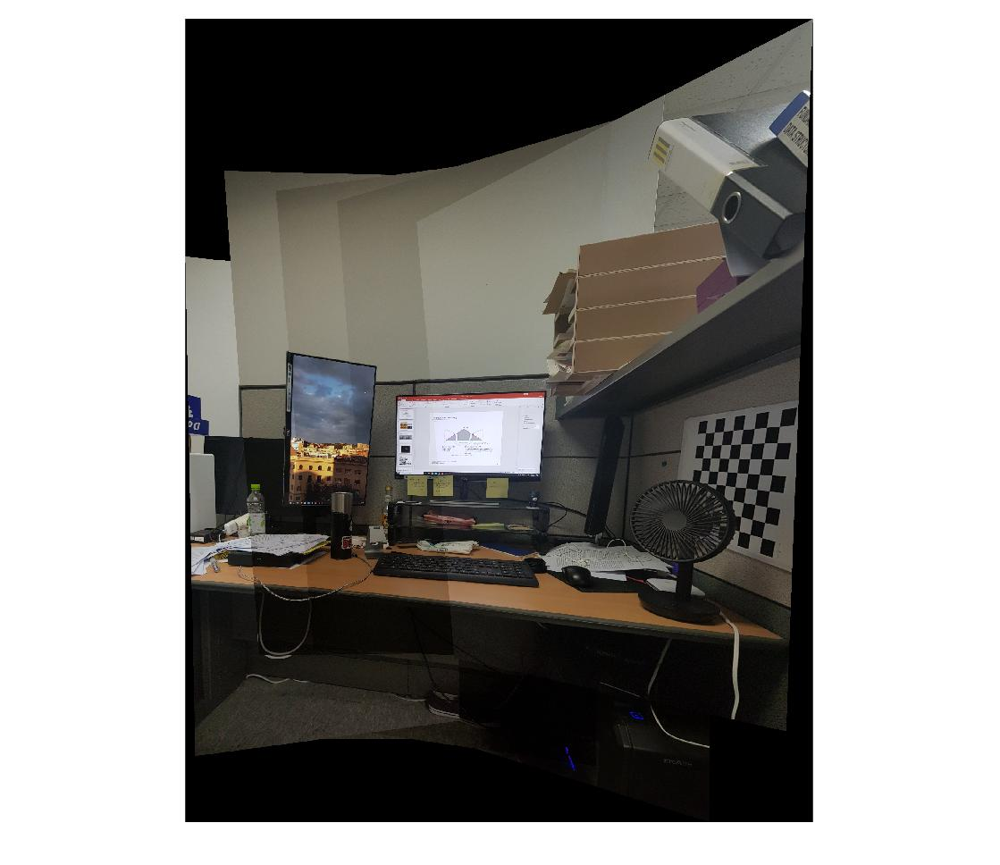

# image_stitching

Matlab code to generate stitched images using homography.

## Requirements
1. Matlab computer vision toolbox
2. Calibrated images (following pinhole camera model)

Image stitching by finding the homography matrix between successive images.\
Features : 
1. Harris corner detector[1]
2. SURF[2]

Matching Method:
1. SAD : Sum of absolute distance
2. SSD : Sum of squared distance
3. NCC : Normalized cross correlation

How does it work:
1. Find features in the images and store them
2. Match features between successive images
3. Perform RANSAC with homography model to get inlier points : Reprojection error is used
4. Do NDLT (normalized direct linear transform) to get an optimized homography matrix
5. Warp the target images into base image.

How to run:
1. Name your images in consecutive order (1.jpg, 2.jpg, 3.jpg ...)
(note : the consecutive images should have some overlapped region)
2. Load the images as in %imgae sample in run.m
3. Set the base image
4. run.

